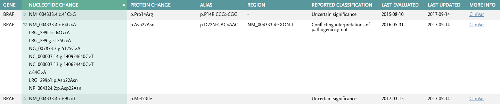

# Variant Search Coding Assignment
## Solution
### Architecture
There are 3 layers to the architecture, each handling a distinct/separate concern
1. `Elasticsearch[ES]`/Indexing: `Elasticsearch` is used for indexing variants, to facilitate fast runtime searches.
    1. `ES` is an ideal candidate for the auto-suggest and subsequent gene lookup
    2. `variants.tsv` is treated as the source of truth, which in realty would be a production-grade database
    3. `ES schema-mapping` is static, `gene` uses the `multi-field` paradigm. `Multi-fields` allow `prefix-match` for `suggestions` and `term-lookup` for the selected `gene` results.
2. `Django`/Web-Server: `Django` is the web server, providing `suggest` and `search` API. These are simple `functional` views. 
3. `React`/Frontend: `React` is the front end app. It uses `redux` for state management and `rxjs` to handle network calls (as side-effects)
    1. `Ag-grid` is heavily used as the `grid` solution. 
    2. `Search` results show matching genes per suggestion; nucleotideChange is grouped with its `otherMappings`, `source` linking etc
    3. In addition to #2, every matching result has the `gene` clickable, which would open a dialog with `all` information about the attributes. This again is a similarly-themed `Ag-grid` 

### Deployment
1. The App is fully dockerized, uses docker 
2. `docker-compose.yml` has 3 services, one per layer
3. `$ docker-compose build` will build the images
4. `$ docker-compose up` will stand-up the application
5. `$ docker-compose down` will tear-down the application
6. `ES` indices are created before django server starts up; this dependency is handled by startup script [`startup.sh`]
7. `ES` Import Job (`import_variants.py`) is handled as a `django` `runscript` 

### Unit tests
1. The import
### End of Solution
## Assignment

Create a web application that allows a user to search for genomic variants by gene name and display the results in a tabular view.

## Features

1. Allow the user to enter a gene name to search for variants in that gene. Display the results in a table that shows various attributes associated with each genomic variant.

2. Provide an auto-suggest feature for entering the gene name.

3. Provide two RESTful endpoints supporting the functionality listed in steps 1 and 2.

## Datasource

A zipped TSV file of variants is available in /data/variants.tsv.zip. Each row in the TSV file represents a genomic variant and contains a Gene column with the gene name. A variant will belong to one and only one gene, but multiple variants may belong to the same gene.

## Implementation

If you are comfortable with Python and/or React, please use these technologies for your app. You may use any additional frameworks, languages, databases, libraries, etc. that you find appropriate.

Our expectation is you will be writing some server code, client code, and applying some basic styling to create a working web application. The application should include unit tests.

Here’s an example of how you might group and display the information:

## Submitting Your Solution

Please clone this repository and upload an archive to Greenhouse, or upload your repository to GitHub and send us a link. Update this README to include instructions on how to install, test, and run your application. Bonus: Deploy it and include the URL here.

As part of the review process, we may comment on or ask questions about specific parts of the code.

Please return your solution within 1 week. This is not an expectation of the time required to complete the assignment. Rather, it’s meant to provide buffer for busy schedules.

## Questions

Please ask if any part of the assignment is unclear. Communicate with us as you would with your project team at work.
